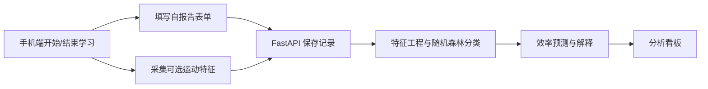

# 大学生学习效率预测系统

本项目面向大学生个人自习场景，以手机网页为轻量采集入口，记录学习时长、自报告状态和可选的手机运动特征，进而训练学习效率三分类模型并在数据看板中展示趋势与解释结果。

当前已完成项目控制文档、后端 P0 API、手机端前端核心闭环、可选的 DeviceMotionEvent 运动特征采集与上传、模型训练前的数据准备脚本、后端模型训练/预测接口，以及前端分析看板。

## MVP 闭环



效率标签规则：

| 自评得分 | 效率标签 |
| --- | --- |
| 1-2 | `low` / 低效率 |
| 3 | `medium` / 中等效率 |
| 4-5 | `high` / 高效率 |

手机运动数据仅作为辅助特征；设备不支持或用户未授权时，学习打卡与自报告主流程仍应可用。

## 技术栈

| 层级 | 计划技术 | 用途 |
| --- | --- | --- |
| 前端 | Vue 3 + Vite + 移动端 UI 组件库 | 手机端打卡、表单和轻量看板 |
| 设备感知 | `DeviceMotionEvent` | 可选采集运动辅助特征 |
| 后端 | Python + FastAPI + Pydantic + SQLAlchemy | REST API、数据校验和服务编排 |
| 数据库 | MySQL | 存储用户、学习会话、运动特征与预测 |
| 建模 | scikit-learn `RandomForestClassifier` | 低/中/高效率分类与特征重要性 |

## 仓库结构

```text
Study-efficiency/
├── AGENTS.md                   # Codex 执行与安全规则
├── README.md                   # 项目入口说明
├── backend/                    # FastAPI + SQLAlchemy 后端
├── frontend/                   # Vue 3 + Vite 手机端前端
├── ml/                         # 训练前数据导出、demo seed 与质量检查脚本
├── docker-compose.yml          # MySQL 开发数据库
└── docs/
    ├── PLAN.md                 # 6 周 MVP 计划与范围
    ├── TASKS.md                # 周任务与验收清单
    ├── API_SPEC.md             # P0 API 草案
    ├── DATA_DICTIONARY.md      # P0 数据字典
    ├── DATA_PREP.md            # Milestone 4A 数据准备说明
    ├── EXPERIMENT_LOG.md       # 模型实验记录模板
    ├── PAGE_FLOW.md            # 手机端页面流程与答辩主线
    ├── DEMO_SCRIPT.md          # 3-5 分钟答辩演示脚本草案
    ├── DATA_COLLECTION_PROTOCOL.md  # 真实数据采集规范
    └── SCREENSHOT_CHECKLIST.md # 报告/PPT/答辩截图清单
```

原始选题方案保留在 `docs/基于手机轻量感知与自报告数据的大学生学习效率预测系统_方案初稿.docx`，作为背景输入，不由当前 milestone 改写。

## 开发顺序

1. **已完成：骨架与文档。** 固定 P0 范围、四张核心表、API 草案与执行规则。
2. **已完成：后端核心 API。** 初始化 FastAPI 与数据库配置，实现 simple-login、学习会话、运动特征接口和基础测试。
3. **已完成：手机端前端核心闭环。** 初始化 Vue 3 + Vite，完成 simple-login、开始学习、计时、结束表单和历史记录。
4. **已完成：运动检测与上传。** 接入 DeviceMotionEvent，统计聚合运动特征并上传后端；不支持传感器时保持主流程可用。
5. **已完成：模型训练前准备。** 提供训练数据 CSV 导出、demo/mock seed 数据和训练前数据质量检查。
6. **已完成：模型训练与预测接口。** 提供 `/api/model/train`、`/api/model/predict`、`/api/model/metrics` 和 `/api/model/feature-importance`。
7. **已完成：数据看板。** 展示总览、趋势、时段对比、特征重要性、运动关系、预测结果和规则建议。

## 本地启动

后端：

```bash
cd backend
python3 -m venv .venv
source .venv/bin/activate
pip install -r requirements.txt
export DATABASE_URL="sqlite:///./study_efficiency.db"
uvicorn app.main:app --reload
```

前端：

```bash
cd frontend
npm install
npm run dev
```

前端默认使用 `VITE_API_BASE_URL=/api`，并由 Vite dev server 将 `/api` 代理到 `VITE_PROXY_TARGET=http://127.0.0.1:8000`。配置示例见 `frontend/.env.example`。

模型训练前数据准备：

```bash
python ml/export_training_data.py
python ml/check_dataset.py
python ml/seed_demo_data.py
```

如本地没有足量真实采集数据，可先运行 `python ml/seed_demo_data.py` 生成单独的 demo/mock SQLite 数据库，再用该数据库验证导出、训练和预测流程。demo/mock 数据只用于开发测试，不得写成真实实验结论；详细说明见 [docs/DATA_PREP.md](docs/DATA_PREP.md)。

2026-06-18 已从 Jahon 远端部署拉取真实数据库到 `data/real/study_efficiency_jahon_20260618.db`，当前真实 completed 样本为 17 条，未达到正式训练建议阈值；另生成 120 条 mock 数据用于课程答辩演示系统闭环。

开始任何开发 milestone 前，请先阅读 [docs/PLAN.md](docs/PLAN.md)、[docs/TASKS.md](docs/TASKS.md)、[docs/API_SPEC.md](docs/API_SPEC.md) 和 [docs/DATA_DICTIONARY.md](docs/DATA_DICTIONARY.md)，并遵循 [AGENTS.md](AGENTS.md)。
