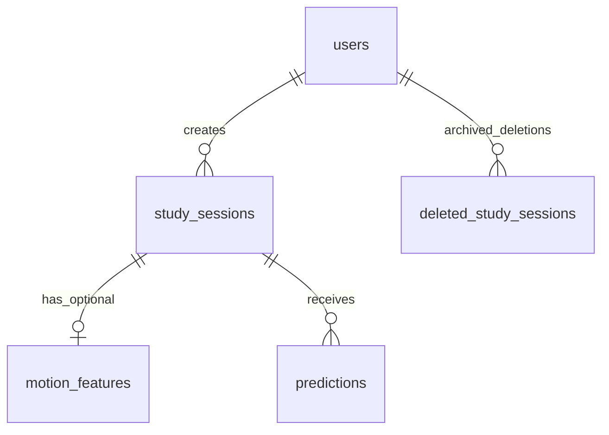

# P0 数据字典

## 1. 设计约定

本字典描述 MVP 当前业务表。字段类型为 MySQL 建议类型，最终 ORM migration 如有调整应同步更新本文档和 `API_SPEC.md`。

| 约定 | 说明 |
| --- | --- |
| 主键 | 使用自增 `BIGINT UNSIGNED` |
| 时间 | 使用 `DATETIME`，应用层统一处理含时区的 ISO 8601 输入输出；服务端存储时保留输入本地墙钟时间 |
| 五级量表 | 整数 `1` 到 `5` |
| 效率标签 | `low`、`medium`、`high` |
| 运动数据 | 是辅助特征，允许整条缺失，不阻塞会话结束 |
| 数据区分 | 开发模拟数据与真实采集数据不得在实验结论中混用或混称 |

关系概览：

## 2. `users`

P0 使用用户自选昵称进入系统，不实现密码、token 或角色权限。同一昵称对应同一个用户；年级和专业是首次创建该昵称用户时的可选资料，不作为区分用户的键。

| 字段 | 建议类型 | 必填 | 约束/示例 | 说明 |
| --- | --- | --- | --- | --- |
| `id` | `BIGINT UNSIGNED` | 是 | PK，自增 | 用户 ID |
| `nickname` | `VARCHAR(50)` | 是 | P0 唯一登录键；`student_a` | 用户自选昵称 |
| `grade` | `VARCHAR(20)` | 否 | `2024` | 年级 |
| `major` | `VARCHAR(100)` | 否 | `物联网工程` | 专业 |
| `created_at` | `DATETIME` | 是 | 服务端生成 | 创建时间 |

## 3. `study_sessions`

一行表示一次学习会话。开始时仅需用户和开始时间；结束时补齐自报告、派生时间和标签。

不设置 `status` 字段；接口响应中的 `in_progress` / `completed` / `abandoned` 由 `end_time` 与 `abandoned_at` 推导。

用户主动放弃一次未结束学习时，只设置 `abandoned_at` 与 `abandon_reason`，不填写结束表单和效率评分。已放弃记录保留在数据库中用于追踪异常或误操作，但不会阻塞同一用户重新开始学习，不进入默认历史列表，也不进入训练数据导出。

历史记录修改功能会直接覆盖该表中对应 `id` 的自报告字段和 `efficiency_score`，并重新计算 `efficiency_label`；不会新增一条学习记录。若该记录已有预测结果，更新时应清理旧预测，避免预测与修改后的记录不一致。

| 字段 | 建议类型 | 必填 | 约束/示例 | 说明 |
| --- | --- | --- | --- | --- |
| `id` | `BIGINT UNSIGNED` | 是 | PK，自增 | 学习记录 ID |
| `user_id` | `BIGINT UNSIGNED` | 是 | FK -> `users.id` | 所属用户 |
| `start_time` | `DATETIME` | 是 | - | 开始时间 |
| `end_time` | `DATETIME` | 结束后是 | `end_time >= start_time` | 结束时间 |
| `abandoned_at` | `DATETIME` | 否 | 服务端生成 | 用户放弃本次学习的时间 |
| `abandon_reason` | `VARCHAR(100)` | 否 | `user_requested` | 放弃原因或来源 |
| `duration_minutes` | `INT UNSIGNED` | 结束后是 | 服务端计算 | 学习分钟数 |
| `time_period` | `VARCHAR(20)` | 结束后是 | `morning` / `afternoon` / `evening` / `late_night` | 开始时间所属时段 |
| `location` | `VARCHAR(30)` | 结束后是 | `dormitory` / `library` / `classroom` / `study_room` / `other` | 学习地点 |
| `task_type` | `VARCHAR(40)` | 结束后是 | `coursework` / `exam_review` / `coding` / `paper_reading` / `postgraduate_prep` / `other` | 任务类型 |
| `goal_clarity` | `TINYINT UNSIGNED` | 结束后是 | `1-5` | 目标清晰度 |
| `light_level` | `TINYINT UNSIGNED` | 结束后是 | `1-5` | 光照感受 |
| `noise_level` | `TINYINT UNSIGNED` | 结束后是 | `1-5` | 噪声程度 |
| `fatigue_level` | `TINYINT UNSIGNED` | 结束后是 | `1-5` | 疲劳程度 |
| `mood_stress` | `TINYINT UNSIGNED` | 结束后是 | `1-5` | 压力/心情状态量表 |
| `phone_distraction` | `TINYINT UNSIGNED` | 结束后是 | `1-5` | 手机干扰程度 |
| `efficiency_score` | `TINYINT UNSIGNED` | 结束后是 | `1-5` | 用户自评效率分数 |
| `efficiency_label` | `VARCHAR(10)` | 结束后是 | `low` / `medium` / `high` | 由评分派生的训练标签 |
| `created_at` | `DATETIME` | 是 | 服务端生成 | 创建时间 |

标签转换规则：

| `efficiency_score` | `efficiency_label` | 中文展示 |
| --- | --- | --- |
| `1-2` | `low` | 低效率 |
| `3` | `medium` | 中等效率 |
| `4-5` | `high` | 高效率 |

时段转换规则：

| 开始时间 | `time_period` |
| --- | --- |
| `05:00-11:59` | `morning` |
| `12:00-17:59` | `afternoon` |
| `18:00-22:59` | `evening` |
| `23:00-04:59` | `late_night` |

## 4. `motion_features`

每个会话最多保存一行聚合后的轻量运动特征，不在 P0 保存原始传感器事件。

上传接口按 `session_id` upsert：不存在则创建，已存在则更新聚合字段。

| 字段 | 建议类型 | 必填 | 约束/示例 | 说明 |
| --- | --- | --- | --- | --- |
| `id` | `BIGINT UNSIGNED` | 是 | PK，自增 | 运动特征 ID |
| `session_id` | `BIGINT UNSIGNED` | 是 | FK -> `study_sessions.id`，唯一 | 对应学习记录 |
| `move_count` | `INT UNSIGNED` | 否 | `>= 0` | 判定为移动的次数 |
| `shake_count` | `INT UNSIGNED` | 否 | `>= 0` | 明显晃动次数 |
| `still_ratio` | `DECIMAL(5,4)` | 否 | `0.0000-1.0000` | 检测期间静止时长占比 |
| `avg_acceleration` | `DECIMAL(10,4)` | 否 | `>= 0` | 加速度幅值平均值 |
| `max_acceleration` | `DECIMAL(10,4)` | 否 | `>= 0` | 加速度幅值最大值 |
| `created_at` | `DATETIME` | 是 | 服务端生成 | 创建时间 |

缺失处理原则：采集失败时可不存在该行；Milestone 4A 的训练数据导出阶段采用填 `0`，并在 CSV 中增加 `motion_available` 标识是否存在运动特征。正式训练和实验记录中仍必须写明该处理方式及限制。

## 5. `predictions`

保存已训练模型对会话生成的预测结果。允许一个会话因模型版本变化而拥有多条预测。

| 字段 | 建议类型 | 必填 | 约束/示例 | 说明 |
| --- | --- | --- | --- | --- |
| `id` | `BIGINT UNSIGNED` | 是 | PK，自增 | 预测 ID |
| `session_id` | `BIGINT UNSIGNED` | 是 | FK -> `study_sessions.id` | 被预测的学习记录 |
| `predicted_label` | `VARCHAR(10)` | 是 | `low` / `medium` / `high` | 预测效率等级 |
| `confidence` | `DECIMAL(5,4)` | 是 | `0.0000-1.0000` | 预测类别置信度 |
| `model_version` | `VARCHAR(80)` | 是 | `rf_20260525_001` | 模型版本标识 |
| `suggestion` | `TEXT` | 否 | - | 规则或模型解释生成的提示 |
| `created_at` | `DATETIME` | 是 | 服务端生成 | 预测时间 |

## 6. `deleted_study_sessions`

保存用户从历史记录中删除过的学习记录备份。删除流程为：先复制 `study_sessions` 字段和当时的可选 `motion_features` 聚合字段到本表，再从当前记录表删除原会话。该表用于追溯和防误删，不作为默认训练数据来源。

| 字段 | 建议类型 | 必填 | 约束/示例 | 说明 |
| --- | --- | --- | --- | --- |
| `id` | `BIGINT UNSIGNED` | 是 | PK，自增 | 备份记录 ID |
| `original_session_id` | `BIGINT UNSIGNED` | 是 | 原 `study_sessions.id` | 被删除学习记录的原 ID |
| `user_id` | `BIGINT UNSIGNED` | 是 | 原 `study_sessions.user_id` | 所属用户 |
| `start_time` | `DATETIME` | 是 | - | 原开始时间 |
| `end_time` | `DATETIME` | 否 | - | 原结束时间 |
| `duration_minutes` | `INT UNSIGNED` | 否 | - | 原学习分钟数 |
| `time_period` | `VARCHAR(20)` | 否 | `morning` 等 | 原时段 |
| `location` | `VARCHAR(30)` | 否 | `library` 等 | 原学习地点 |
| `task_type` | `VARCHAR(40)` | 否 | `coding` 等 | 原任务类型 |
| `goal_clarity` | `TINYINT UNSIGNED` | 否 | `1-5` | 原目标清晰度 |
| `light_level` | `TINYINT UNSIGNED` | 否 | `1-5` | 原光照感受 |
| `noise_level` | `TINYINT UNSIGNED` | 否 | `1-5` | 原噪声程度 |
| `fatigue_level` | `TINYINT UNSIGNED` | 否 | `1-5` | 原疲劳程度 |
| `mood_stress` | `TINYINT UNSIGNED` | 否 | `1-5` | 原压力/心情状态 |
| `phone_distraction` | `TINYINT UNSIGNED` | 否 | `1-5` | 原手机干扰程度 |
| `efficiency_score` | `TINYINT UNSIGNED` | 否 | `1-5` | 原效率分数 |
| `efficiency_label` | `VARCHAR(10)` | 否 | `low` / `medium` / `high` | 原效率标签 |
| `session_created_at` | `DATETIME` | 是 | - | 原会话创建时间 |
| `motion_available` | `TINYINT UNSIGNED` | 是 | `0` / `1` | 删除时是否存在运动特征 |
| `move_count` | `INT UNSIGNED` | 否 | - | 删除时的运动特征快照 |
| `shake_count` | `INT UNSIGNED` | 否 | - | 删除时的运动特征快照 |
| `still_ratio` | `DECIMAL(5,4)` | 否 | - | 删除时的运动特征快照 |
| `avg_acceleration` | `DECIMAL(10,4)` | 否 | - | 删除时的运动特征快照 |
| `max_acceleration` | `DECIMAL(10,4)` | 否 | - | 删除时的运动特征快照 |
| `deleted_at` | `DATETIME` | 是 | 服务端生成 | 删除/归档时间 |
| `delete_source` | `VARCHAR(40)` | 是 | `user_history` | 删除来源 |

## 7. 后续数据表

`model_metrics` 与 `feature_importance` 属于 P1，可在模型 milestone 决定是否持久化；P0 阶段的训练结果先记录于 `EXPERIMENT_LOG.md` 并通过模型 API 返回。

## 8. 离线训练数据 CSV

Milestone 4A 新增离线训练前数据集，不是数据库表。默认由 `ml/export_training_data.py` 导出到 `data/processed/training_dataset.csv`，数据来源为：

1. `study_sessions` 中 `end_time` 不为空且 `efficiency_score` 不为空的记录。
2. 排除 `abandoned_at` 不为空的已放弃记录。
3. left join `motion_features`，保留没有运动特征的学习记录。
4. `efficiency_label` 在导出时由 `efficiency_score` 重新转换，避免历史字段不一致影响训练准备。

用户删除过的记录保存在 `deleted_study_sessions`，不会被默认训练数据导出脚本纳入。
用户放弃过的记录仍在 `study_sessions`，但 `abandoned_at` 不为空，也不会被默认训练数据导出脚本纳入。

| 字段 | 来源 | 说明 |
| --- | --- | --- |
| `session_id` | `study_sessions.id` | 问题定位字段，默认不作为训练特征 |
| `user_id` | `study_sessions.user_id` | 问题定位字段，默认不作为训练特征 |
| `duration_minutes` | `study_sessions.duration_minutes` | 数值特征 |
| `time_period` | `study_sessions.time_period` | 类别特征，后续训练阶段再 One-Hot |
| `location` | `study_sessions.location` | 类别特征，后续训练阶段再 One-Hot |
| `task_type` | `study_sessions.task_type` | 类别特征，后续训练阶段再 One-Hot |
| `goal_clarity` | `study_sessions.goal_clarity` | 五级自报告特征 |
| `light_level` | `study_sessions.light_level` | 五级自报告特征 |
| `noise_level` | `study_sessions.noise_level` | 五级自报告特征 |
| `fatigue_level` | `study_sessions.fatigue_level` | 五级自报告特征 |
| `mood_stress` | `study_sessions.mood_stress` | 五级自报告特征 |
| `phone_distraction` | `study_sessions.phone_distraction` | 五级自报告特征 |
| `move_count` | `motion_features.move_count` | 缺失运动特征时填 `0` |
| `shake_count` | `motion_features.shake_count` | 缺失运动特征时填 `0` |
| `still_ratio` | `motion_features.still_ratio` | 缺失运动特征时填 `0` |
| `avg_acceleration` | `motion_features.avg_acceleration` | 缺失运动特征时填 `0` |
| `max_acceleration` | `motion_features.max_acceleration` | 缺失运动特征时填 `0` |
| `motion_available` | 导出脚本派生 | `1` 表示存在运动特征行，`0` 表示缺失并已填 `0` |
| `efficiency_score` | `study_sessions.efficiency_score` | 标签转换来源 |
| `efficiency_label` | 导出脚本派生 | `low` / `medium` / `high` |

`data/processed/data_quality_report.md` 为质量检查输出，包含样本数、标签分布、缺失运动特征、已放弃源记录数量、异常学习时长、自报告越界和最低训练样本数检查。demo/mock 数据与真实采集数据必须通过数据库来源、导出说明和实验日志区分，不得混称。
