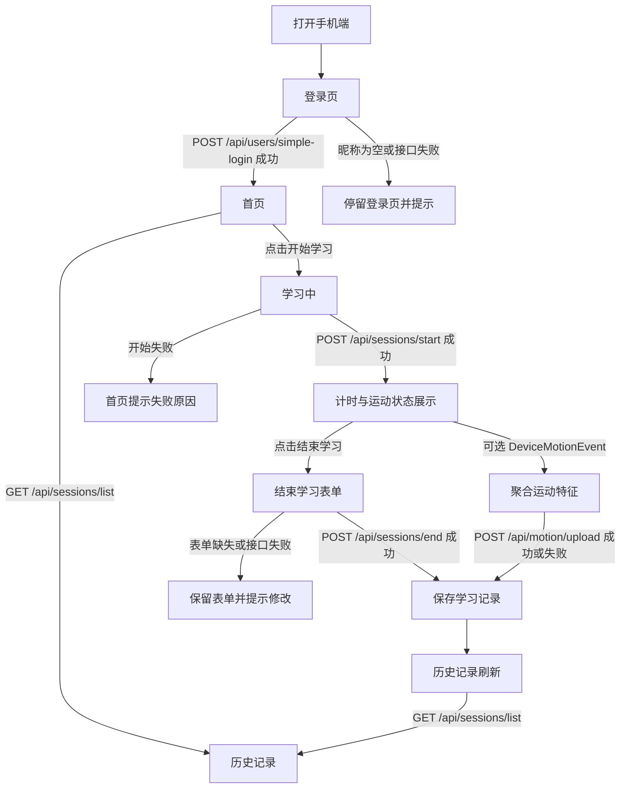

# 手机端页面流程

> 文档状态：Milestone 3C 展示与实验准备材料  
> 适用范围：当前 Vue 手机端核心闭环，不包含模型训练页、ECharts 看板或管理端。

## 1. 流程图

运动检测只提供辅助特征。权限拒绝、设备不支持、采样为空或上传失败，都不影响学习开始、结束、自报告保存和历史记录查看。

## 2. 页面说明

| 页面 | 核心操作 | 调用 API | 成功状态 | 失败状态 |
| --- | --- | --- | --- | --- |
| 登录页 | 输入昵称，可选填写年级和专业，进入系统 | `POST /api/users/simple-login` | 返回用户信息，保存当前 `user_id`，进入首页 | 昵称为空时前端提示；接口失败时停留登录页并展示错误 |
| 首页 | 查看当前用户与学习状态，开始学习，进入历史记录 | `POST /api/sessions/start`；进入历史时调用 `GET /api/sessions/list` | 创建进行中会话，进入学习中页面；历史记录正常加载 | 重复开启未结束会话或网络失败时提示，不创建新的本地记录 |
| 学习中 | 展示计时器、会话状态、运动检测状态，结束学习 | `POST /api/sessions/start` 的结果用于当前会话；结束时转入表单 | 计时持续显示；若传感器可用，展示运动状态和聚合值 | 传感器不可用时展示降级提示；主计时与结束按钮仍可用 |
| 结束学习表单 | 填写地点、任务类型、目标清晰度、光照、噪声、疲劳、压力、手机干扰和效率评分 | `POST /api/sessions/end`；若有运动数据再调用 `POST /api/motion/upload` | 保存会话、自报告字段和效率标签；运动上传成功则保存辅助特征；跳转或刷新历史 | 表单校验失败时要求补填；会话结束失败时不上传运动数据；运动上传失败只警告不阻断 |
| 历史记录 | 查看已完成和进行中的学习记录 | `GET /api/sessions/list`；详情可使用 `GET /api/sessions/{id}` | 展示开始时间、时长、任务类型、效率评分和效率标签 | 列表加载失败时显示错误或空状态，不影响再次返回首页操作 |

## 3. 答辩主线

1. 为什么做：大学生自习效率受环境、疲劳、目标清晰度和手机干扰影响，但很多记录方式只看时长，缺少过程和主观状态。
2. 做了什么：系统用手机网页完成开始学习、结束学习、自报告填写、可选运动聚合和后端存储，形成可训练的数据闭环。
3. AI 如何体现：后续使用已采集记录做特征工程，训练低/中/高三分类模型，并输出指标和特征重要性；当前 3C 只准备数据采集与演示材料，不宣称模型已完成。
4. 创新在哪里：把手机轻量感知、学习自报告、全栈记录系统和可解释机器学习放入同一个可演示闭环。
5. 风险如何处理：传感器失败不阻断主流程；样本不足时只做演示和方法说明；真实、模拟、测试数据分开记录。

## 4. 边界说明

- 当前页面流程不包含完整注册登录、JWT、管理端、预测页或看板页。
- `motion_features` 可以为空，模型阶段再统一处理缺失值。
- 所有演示数据必须标注来源，不能把模拟数据写成真实实验结论。
