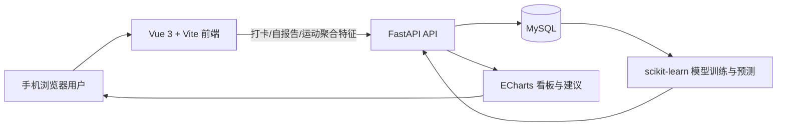
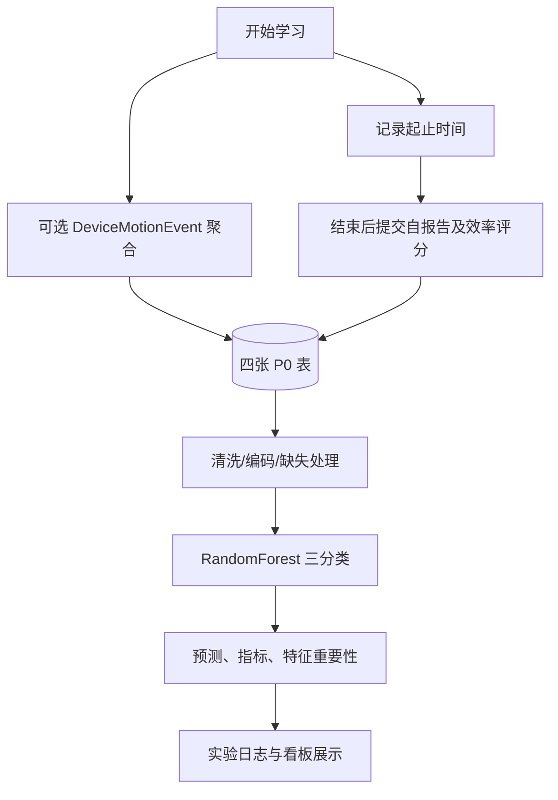

# 6 周 MVP 计划：大学生学习效率预测系统

> 文档状态：Milestone 1 已确认的 MVP 实施基线  
> 确认日期：2026-05-25  
> 当前阶段：仓库骨架与项目控制文档完成，尚未进入复杂业务实现

## 1. 项目目标

本 MVP 保留核心闭环：

手机端学习打卡 → 自报告表单 → 手机运动辅助特征 → 后端存储 → 数据清洗与特征工程 → 效率预测 → 可视化看板 → 答辩展示。

6 周内优先做“可运行、可演示、可解释”的最小系统，不追求复杂账号体系、高精度模型、完整论文级实验或生产级部署。

核心成功标准：

1. 用户能在手机浏览器完成一次学习记录。
2. 系统能保存学习记录、自报告数据和可选运动特征。
3. 后端能基于历史数据训练低/中/高三分类模型。
4. 前端能展示学习趋势、效率趋势、特征重要性和预测结果。
5. 答辩时能讲清楚物联网、AI、全栈系统和科研实验设计分别体现在哪里。

### Milestone 1 验收范围

本里程碑只建立项目入口、Codex 执行规则和 P0 契约文档，不初始化业务应用或安装大型依赖。交付文件为 `README.md`、`AGENTS.md`、`docs/PLAN.md`、`docs/TASKS.md`、`docs/API_SPEC.md`、`docs/DATA_DICTIONARY.md` 与 `docs/EXPERIMENT_LOG.md`。

### 系统架构草图

### 数据流草图

---

## 2. MVP Must Have

### P0 必做

1. 手机端打卡：
   - 开始学习
   - 结束学习
   - 实时计时
   - 结束后填写表单

2. 自报告数据：
   - 学习地点
   - 任务类型
   - 目标清晰度
   - 光照感受
   - 噪声程度
   - 疲劳程度
   - 心情/压力
   - 手机干扰程度
   - 学习效率评分

3. 手机运动辅助特征：
   - move_count
   - shake_count
   - still_ratio
   - avg_acceleration
   - max_acceleration

   注意：传感器不可用时允许为空，不影响打卡主流程。

4. 后端与数据库：
   - users
   - study_sessions
   - motion_features
   - predictions

5. 效率预测：
   - 1-2 分 = 低效率
   - 3 分 = 中等效率
   - 4-5 分 = 高效率
   - 主模型使用 RandomForestClassifier
   - 输出 Accuracy、F1-score、混淆矩阵、特征重要性

6. 可视化看板：
   - 总学习次数
   - 总学习时长
   - 平均效率评分
   - 高效学习占比
   - 学习时长趋势
   - 效率评分趋势
   - 不同时间段效率对比
   - 特征重要性
   - 手机运动次数与效率关系

7. 答辩材料：
   - 项目背景
   - 系统架构
   - 数据采集流程
   - 数据库设计
   - 模型训练流程
   - 模型指标
   - 系统截图
   - 演示脚本
   - 风险说明

---

## 3. Defer / Later

以下功能不进入 MVP，除非 P0 全部完成后还有时间：

1. 完整注册登录、JWT、权限系统。
2. 找回密码。
3. 多角色管理端。
4. 班级/群组对比。
5. XGBoost、LightGBM、SVM 深度调参。
6. 公开数据集接入训练。
7. 复杂推荐算法。
8. 生产级云部署。
9. 多端适配。
10. 复杂后台管理系统。

MVP 登录策略：

使用 simple-login，即输入昵称创建或进入用户，不做复杂认证。

---

## 4. 数据库设计优先级

### P0 表

#### users

- id
- nickname
- grade
- major
- created_at

#### study_sessions

- id
- user_id
- start_time
- end_time
- duration_minutes
- time_period
- location
- task_type
- goal_clarity
- light_level
- noise_level
- fatigue_level
- mood_stress
- phone_distraction
- efficiency_score
- efficiency_label
- created_at

#### motion_features

- id
- session_id
- move_count
- shake_count
- still_ratio
- avg_acceleration
- max_acceleration
- created_at

#### predictions

- id
- session_id
- predicted_label
- confidence
- model_version
- suggestion
- created_at

### P1 表

#### model_metrics

- id
- model_version
- sample_count
- train_accuracy
- test_accuracy
- f1_score
- confusion_matrix_json
- created_at

#### feature_importance

- id
- model_version
- feature_name
- importance_score
- created_at

---

## 5. API 优先级

### P0 API

#### 用户

- POST /api/users/simple-login

#### 学习记录

- POST /api/sessions/start
- POST /api/sessions/end
- GET /api/sessions/list
- GET /api/sessions/{id}

#### 手机运动数据

- POST /api/motion/upload
- GET /api/motion/{session_id}

#### 模型

- POST /api/model/train
- POST /api/model/predict
- GET /api/model/metrics
- GET /api/model/feature-importance

#### 可视化统计

- GET /api/analytics/overview
- GET /api/analytics/trend
- GET /api/analytics/factor-analysis

### 延期 API

- POST /api/users/register
- POST /api/users/login
- GET /api/users/me
- 多用户横向对比 API
- 管理端 API

---

## 6. 页面优先级

### P0 页面

1. 首页
   - 项目名称
   - 今日学习时长
   - 最近一次效率评分
   - 开始学习按钮

2. 学习中页面
   - 当前学习时长
   - 手机运动检测状态
   - 结束学习按钮

3. 结束学习表单页
   - 学习地点
   - 任务类型
   - 目标清晰度
   - 光照
   - 噪声
   - 疲劳
   - 心情/压力
   - 手机干扰
   - 本次效率评分

4. 学习记录页
   - 历史记录列表
   - 每次学习时长
   - 效率评分
   - 预测结果

5. 数据看板页
   - 总览卡片
   - 学习时长趋势
   - 效率评分趋势
   - 时间段对比
   - 特征重要性
   - 运动次数与效率关系

6. 模型预测结果区
   - 可以单独做页面，也可以合并到记录详情或看板中
   - 展示预测等级、置信度、主要影响因素和建议

---

## 7. 模型训练方案

### P0 主流程

1. 标签转换：
   - 1-2 = low
   - 3 = medium
   - 4-5 = high

2. 特征处理：
   - 数值特征：duration_minutes、goal_clarity、light_level、noise_level、fatigue_level、mood_stress、phone_distraction、move_count、shake_count、still_ratio、avg_acceleration、max_acceleration
   - 类别特征：time_period、location、task_type
   - 类别特征使用 OneHotEncoder
   - 缺失运动特征允许填 0 或使用均值填充，但必须在报告中说明

3. 主模型：
   - RandomForestClassifier

4. 输出：
   - Accuracy
   - Precision
   - Recall
   - F1-score
   - Confusion Matrix
   - Feature Importance

5. 小样本策略：
   - 样本数 < 30：不声称模型可靠，只展示流程，使用规则建议或演示模型。
   - 样本数 30-50：可以训练模型，但报告中说明结果仅供课程实验参考。
   - 样本数 > 50：可以展示模型指标和特征重要性。
   - 优先使用 train/test split；如果数据太少，使用简单交叉验证或说明样本限制。

### P1 补充

1. DecisionTreeClassifier 作为对比模型。
2. LogisticRegression 作为对比模型。
3. RandomForestRegressor 预测 1-5 分，作为报告补充实验，不作为主功能。

---

## 8. 数据采集计划

1. 第 1 周确定字段和评分规则。
2. 第 2 周开始内部自测数据采集。
3. 第 3-4 周集中采集真实数据。
4. 目标至少 50 条，理想 80-120 条。
5. 每条记录尽量来自真实学习场景。
6. 模拟数据只能用于开发测试，不作为最终实验结论。
7. 报告中必须区分真实采集数据和测试模拟数据。

---

## 9. Codex 使用规则

### 必须创建 AGENTS.md

AGENTS.md 中必须写明：

1. 每次修改前先阅读 docs/PLAN.md 和 docs/TASKS.md。
2. 一次只完成一个明确 milestone。
3. 不允许一次性重构整个项目。
4. 不允许删除用户已有数据。
5. 不允许提交真实密钥、密码、token。
6. 不允许修改系统全局环境，除非用户确认。
7. 每次完成后必须运行对应验证命令。
8. 后端修改后运行 pytest 或至少启动 FastAPI 检查 /docs。
9. 前端修改后运行 npm run build。
10. 数据库变更必须同步更新文档。

### Codex Goal 使用原则

不要直接使用：

/goal 完成整个项目

应该拆成多个小 goal：

1. 初始化项目骨架。
2. 完成后端核心 API。
3. 完成前端打卡流程。
4. 完成运动检测与降级。
5. 完成模型训练与预测接口。
6. 完成看板。
7. 完成部署与答辩材料。

每个 goal 必须包含：

1. 修改范围。
2. 完成标准。
3. 验证命令。
4. 禁止事项。
5. 遇到阻塞时暂停并报告。

---

## 10. 6 周计划

### 第 1 周：定界与骨架

目标：

完成 MVP 范围、数据字段、数据库设计、页面原型、仓库结构和 Codex 执行规则。

任务：

1. 创建 README.md。
2. 创建 AGENTS.md。
3. 创建 docs/PLAN.md。
4. 创建 docs/TASKS.md。
5. 创建 docs/API_SPEC.md。
6. 创建 docs/DATA_DICTIONARY.md。
7. 创建 docs/EXPERIMENT_LOG.md。
8. 明确 P0/P1/P2 功能范围。

验收：

1. 项目结构清楚。
2. 后续 Codex 可以根据文档执行。
3. 不开始复杂业务开发。

### 第 2 周：后端与数据库主流程

目标：

完成 FastAPI + MySQL + SQLAlchemy 的核心后端。

任务：

1. 初始化 backend。
2. 配置数据库连接。
3. 实现四张 P0 表。
4. 实现 simple-login。
5. 实现开始学习。
6. 实现结束学习。
7. 实现学习记录列表。
8. 实现运动特征上传。
9. 编写基础测试。

验收：

1. FastAPI 能启动。
2. /docs 能看到接口。
3. 数据能写入 MySQL。
4. pytest 通过或至少核心接口手动测试通过。

### 第 3 周：前端打卡流程与运动检测

目标：

完成手机端可用的前端 MVP。

任务：

1. 初始化 Vue 3 + Vite。
2. 配置移动端 UI。
3. 完成首页。
4. 完成学习中页面。
5. 完成结束学习表单。
6. 完成历史记录页。
7. 接入 DeviceMotionEvent。
8. 实现传感器不可用时的降级提示。
9. 开始真实数据采集。

验收：

1. 手机浏览器可以开始学习、结束学习、提交表单。
2. npm run build 通过。
3. 传感器不可用时主流程不崩溃。

### 第 4 周：模型训练与预测接口

目标：

完成效率三分类模型和预测服务。

任务：

1. 编写数据导出或读取逻辑。
2. 编写特征工程。
3. 实现标签转换。
4. 训练 RandomForestClassifier。
5. 输出模型指标。
6. 输出特征重要性。
7. 保存模型文件。
8. 实现 /api/model/train。
9. 实现 /api/model/predict。
10. 实现 /api/model/metrics。
11. 实现 /api/model/feature-importance。

验收：

1. 有模型文件。
2. 能输出指标。
3. 能预测低/中/高效率。
4. 数据不足时有明确提示，不伪装高准确率。

### 第 5 周：数据看板与规则建议

目标：

完成答辩可展示的分析页面。

任务：

1. 实现 overview 统计。
2. 实现 trend 统计。
3. 实现 factor-analysis。
4. 前端展示 ECharts 图表。
5. 展示特征重要性。
6. 展示运动次数与效率关系。
7. 实现规则建议。

验收：

1. 看板能展示趋势和统计。
2. 预测结果有建议。
3. 前后端端到端联调通过。

### 第 6 周：冻结功能与答辩准备

目标：

停止新增大功能，专注稳定性、报告、PPT 和演示。

任务：

1. 修复核心 bug。
2. 补齐演示数据。
3. 整理系统截图。
4. 整理模型结果截图。
5. 准备报告。
6. 准备 PPT。
7. 准备演示脚本。
8. 准备备用录屏。
9. 做完整答辩彩排。

验收：

1. 演示流程完整。
2. 报告有图、有数据、有模型结果。
3. PPT 能讲清楚背景、系统、AI、创新点、风险。
4. 即使现场网络或传感器失败，也能用录屏和样例数据完成展示。

---

## 11. 风险与解决方案

### 风险 1：手机传感器兼容性不稳定

解决：

1. 手机运动数据只作为辅助特征。
2. 权限失败时允许为空。
3. 保留手动填写的手机干扰程度字段。
4. 答辩中说明这是 Web 端轻量感知的现实限制。

### 风险 2：数据量不够

解决：

1. 先用少量真实数据跑通流程。
2. 邀请同学补充数据。
3. 样本不足时强调系统闭环和可解释分析。
4. 模拟数据只用于测试，不包装成真实结论。

### 风险 3：模型准确率一般

解决：

1. 不把亮点压在准确率上。
2. 展示特征重要性、趋势图、混淆矩阵。
3. 说明小样本限制。
4. 强调模型用于课程实验和趋势分析。

### 风险 4：开发时间紧

解决：

1. 优先打通 MVP。
2. 延期复杂登录、管理端、多模型调参。
3. 第 6 周冻结功能。
4. 保留备用演示视频。

---

## 12. 最终成功标准

项目完成时至少应具备：

1. 一个能运行的手机网页系统。
2. 一个能保存数据的后端服务。
3. 一个 MySQL 数据库。
4. 一个三分类预测模型。
5. 一个可视化看板。
6. 一份项目报告。
7. 一份答辩 PPT。
8. 一个完整演示流程。
